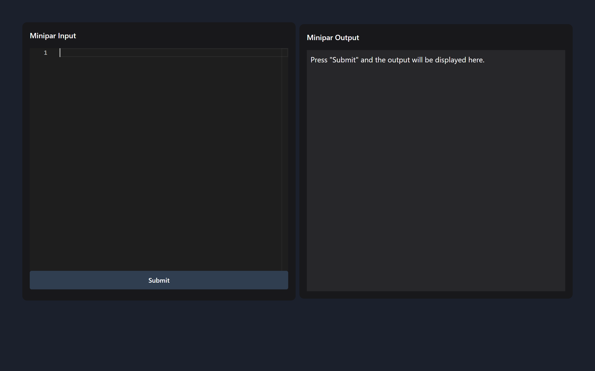

# MiniparInterpreter | Compiladores e Reuso de Software

## 📖 Descrição

O **MiniparInterpreter** é um interpretador para uma linguagem customizada, projetado para executar código a partir de árvores sintáticas abstratas (AST). Ele faz parte de um sistema completo que inclui um backend para análise e interpretação e um frontend para interface com o usuário.

<p align="center">
  
</p>

## 👥 Integrantes

    <center>
Group:
    Matheus Ryan | Manoel Terceiro | Victor Hugo | Lucas Heron | Fernando Gabriel
 </center>

## 📁 Estrutura do Projeto

```plaintext
MiniparInterpreter/
├── back/                    # Backend (API e lógica do interpretador)
│   ├── interpreter/
│   │   └── src/interpreter.py     
│   ├── interpreter.py       # Implementação do interpretador
│   ├── main.py              # Endpoints da API (FastAPI)
│   ├── common/
│   │   └── tokens.py        # Definições de tokens
│   ├── semantic/
│   │   └── src/semantic_analyzer.py
│   ├── syntactic/
│   │   └── src/parser.py    # Analisador sintático
│   ├── trees/
│   │   └── syntax_tree.py   # Implementação da árvore sintática
│   └── requirements.txt     # Dependências do backend
└── front/                   # Frontend (Interface com o usuário)
```

## 🛠️ Instalação

Siga os passos abaixo para configurar e executar o projeto **MiniparInterpreter**.

### Pré-requisitos

- Python 3.10 ou superior
- `pip` para instalação de pacotes Python
- Navegador web (para acessar o frontend)

### 1. Clone o Repositório

```bash
git clone <url-do-repositorio>
cd MiniparInterpreter
```

### 2. Configuração do Backend
O backend está localizado na pasta back.

* Instale as dependências
```bash
cd back
pip install -r requirements.txt
```

* Execute o makefile
```bash
make run-all   
```
O servidor backend estará disponível em http://localhost:8000.

### 3. Configuração do Frontend
O frontend está localizado na pasta front e consiste em arquivos HTML, JavaScript e CSS. Feito em react

* Execute o inicializador do react
```bash
npm run dev 
```

### 4.🚀 Uso do Sistema

* Enviar Código para Interpretação
No frontend, insira o código a ser interpretado na área de texto e clique em Executar. O resultado será exibido na área de saída logo abaixo.

* Exemplo de Código

```bash
int i = 1;
int resultado = 1;

for (i = 1; i <= 5; i = i + 1) {
    resultado = resultado * i;
}

print(resultado);
```

* Exemplo de saída
```bash
120
```

* Exemplo da interface


### 5.🛠️ Funcionalidades Adicionais
* Execução Concorrente: Suporte para execução de blocos de código em paralelo usando threading.
* Exportação de AST: Exporta a árvore sintática abstrata para um arquivo JSON.
* Servidor Cliente via Socket: Comunicação cliente-servidor para execução remota de procedimentos.

### 📄 Licença
Este projeto está licenciado sob a MIT License. Consulte o arquivo LICENSE para mais detalhes.